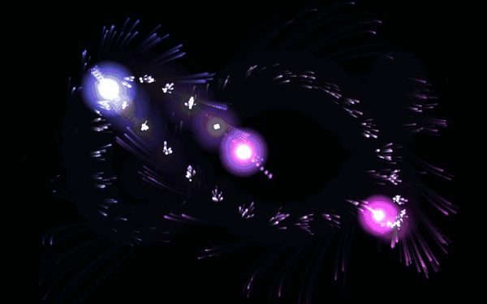

# FLUX·TONE

  
  
  

  

  
  &nbsp;
  <a href="https://sixfive7.github.io/FluxTone/"><b>sixfive7.github.io/FluxTone</b></a>

A touch-and-drag generative synthesizer that lives in a single HTML file.

Drag anywhere on the screen to play. Move **left / right** to sweep pitch, **up / down**
to shape the timbre, and use **several fingers** for chords — every gesture drives a
fluid, audio-reactive visualizer built on the Web Audio API and a canvas particle field.

You can also **record** your performance, play it back, and **download** it — captured
and stored entirely in your browser, with no server involved.

There is no build step and no framework. The entire instrument is one self-contained
`.html` file you can open locally or host as static content anywhere.

## Play it

Open `index.html` in a modern browser, or drop the folder behind any static web server.
Play it live on **[GitHub Pages](https://sixfive7.github.io/FluxTone/)**.

`index.html` always serves a copy of the latest release. Every version is also kept as
its own file, so older ones stay playable:

| File | Version |
| ---- | ------- |
| `v1.html` | the original synth |
| `v2.html` | adds recording — capture, replay, and download your takes |
| `v2.1.html` | downloads as MP3; asks for storage only when you first record |

See [CHANGELOG.md](CHANGELOG.md) for what changed between versions. This project follows
[Semantic Versioning](https://semver.org).

## Development

There is nothing to build — edit the HTML directly. Browser-based testing and
verification run through a set of Playwright MCP servers (headless / interactive /
tracing / persistent) driven by a single parametric launcher; see
[playwright/README.md](playwright/README.md) and [CLAUDE.md](CLAUDE.md).

## License

[MIT](LICENSE) © Jori Huisman
